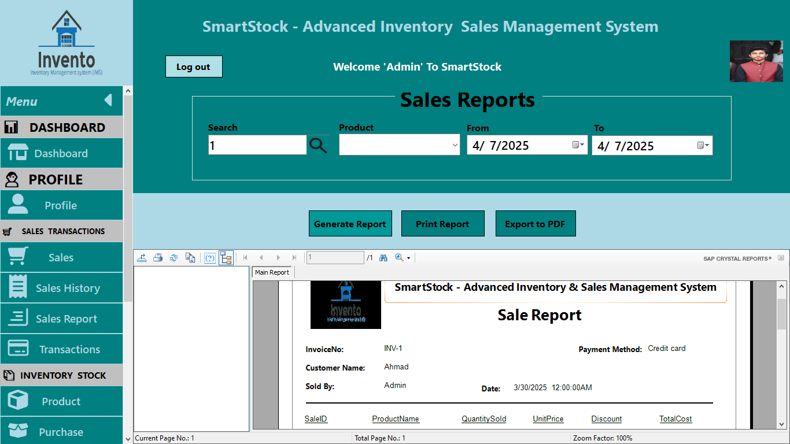

# SmartStock - Advanced Inventory & Sales Management System

**SmartStock** is a robust and comprehensive **C# Windows Forms** application designed to streamline inventory and sales management for businesses. It offers efficient tools for managing sales, inventory, suppliers, customers, and reporting. With a user-friendly interface and secure functionalities, SmartStock is ideal for businesses looking to improve their operational efficiency.

---

## Features

### **User Authentication**
- **Secure Registration**: Users can register securely using **BCrypt** password hashing to ensure data privacy.
- **Login with "Remember Me"**: The login system allows users to securely log in with the "Remember Me" option (email only for security).
- **Forgot Password**: An intuitive password recovery process using security questions for account recovery. Admin-assisted password recovery available if security questions are not set.

### **Dashboard Overview**
- **Quick Summary**: View an overview of key business metrics, including **total sales, transactions, products, suppliers, categories, customers**, and **purchases**.
- **Today's Records**: Displays today's sales, purchases, and transactions for quick access to real-time data.

### **Profile Management**
- **Personal Information**: Users can update their profile details and upload a profile photo.
- **Password Management**: Change passwords securely and manage security settings.
- **Security Questions**: Set or update security questions to further protect user accounts.

### **Sales Management**
- **Dynamic Sale Creation**: Add multiple products to a sale and view real-time details for each product and overall sale.
- **Sale Confirmation**: Confirm and store sales data in the database.
- **Receipt Generation**: Generate and print a sale receipt after confirming the transaction.

### **Sales History**
- **Transaction Search**: Search and view past sales by **ID**, **Invoice No**, or **date range**.
- **Export to PDF/Excel**: Export sales history to **PDF** or **Excel** for reporting and archiving purposes.

### **Reporting**
- **Crystal Reports**: Generate detailed business reports using **Crystal Reports**.
- **PDF Reports**: Create and export reports as **PDFs** using **iTextSharp** for efficient sharing and archiving.

### **Modern UI**
- **Sleek User Interface**: A modern, user-friendly interface built using **MetroFramework** and **FontAwesomeSharp** icons for an intuitive experience.

---

## Technologies Used

- **C# Windows Forms (.NET Framework 4.7.2)**
- **Microsoft SQL Server** (Database)
  - **Stored Procedures** for optimized and secure database operations
- **BCrypt** for secure password hashing
- **Crystal Reports** for generating business reports
- **MetroFramework** for the modern UI design
- **FontAwesomeSharp** for scalable vector icons
- **iTextSharp** for PDF generation

---

## Installation Guide

To get started with **SmartStock**, follow these simple steps to set up the project on your local machine.

### Prerequisites

- **Microsoft Visual Studio** (Version 2019 or later)
- **.NET Framework 4.7.2**
- **SQL Server** (for local database management)

### Steps to Install

1. **Clone the Repository**
   Clone the repository to your local machine using the following command:
   ```bash
   git clone https://github.com/your-username/SmartStock.git


   ## Screenshots

### Login


### Forgot Password


### Dashboard


### Profile


### Sales


### Sales History


### Sale Report


### Transactions


### Products


### Purchase


### Categories


### Suppliers


### Customers


### Manage Users


### General Setting


### Permission Setting


### Security Setting


### Data Management

